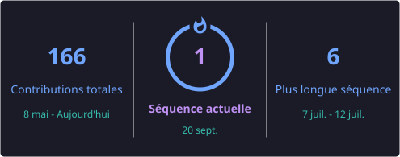

# Arsène Gloire AKIANA

### Software Engineer · Full-Stack Web Developer

Building practical and reliable web applications from **Brazzaville, Republic of the Congo 🇨🇬**, with a focus on **full-stack development, software engineering fundamentals, and real-world problem solving**.

 
---

## About

I’m a **Software Engineering student at CFI-CIRAS** and a **Full-Stack Web Development trainee at Akieni Academy**.

My background combines **algorithms, software architecture, systems, and web development**, which I apply to building maintainable and user-focused software.

I’m currently focused on strengthening my skills across the full development lifecycle — from **responsive interfaces and APIs to databases, application architecture, version control, and deployment workflows**.

### Current Focus

- Building full-stack web applications with **TypeScript, React, Next.js, Node.js, and PostgreSQL**
- Improving my knowledge of **software architecture, APIs, databases, and clean code**
- Turning real-world requirements into **simple, maintainable, and useful software**
- Developing toward **international software engineering and full-stack opportunities**

---

## Tech Stack

### Frontend

### Backend & Database

### Tools & Workflow

---

## Experience

### Private STEM Tutor
**Self-employed · 2023 – Present**

- Created personalized learning plans for **10+ students**
- Taught mathematics and physics through structured problem-solving approaches
- Adapted teaching methods to different learning needs

### Head of Freshman Program
**ISTP · 2024 – 2025**

- Coordinated academic operations for approximately **230 students**
- Supported activities across **6 departments**
- Helped improve communication and coordination within the freshman program

### Lead Class Representative
**ISTP · 2024 – 2025**

- Organized academic resources to make information easier to access
- Supported communication between students and academic administration

---

## Education

**BSc Software Engineering**  
CFI-CIRAS · Brazzaville · **2025 – 2027**

**Full-Stack Web Development**  
Akieni Academy · **2026**

---

## GitHub Stats

  
  

  

---

## Languages

**French** — Native  
**English** — Professional working proficiency

---

## Connect

I’m interested in **software engineering, full-stack web development, real-world product development, and opportunities to collaborate with ambitious teams**.

[LinkedIn](https://www.linkedin.com/in/arsene-akiana) · [Email](mailto:akianaarsenegloire@gmail.com)
